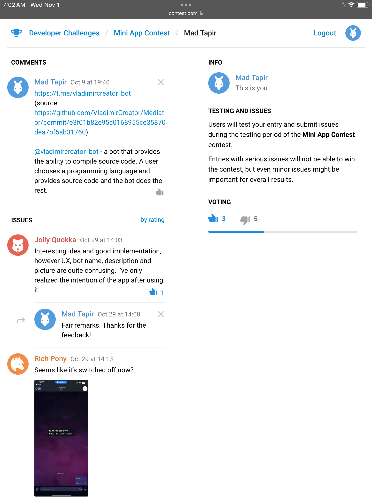

# Mediator

## Table of Contents
- [Description](#description)
- [About](#about)
- [Results](#results)
- [Getting Started](#getting-started)
	- [Clone](#1-clone)
	- [Prepare .env](#2-prepare-env)
	- [Docker](#docker)
- [Backend](#backend)
	- [Build]()
	- [Docker]()
- [Frontend](#frontend)
	- [Build]()
	- [Docker]()
- [User Guide](#user-guide)
- [Aspects to Improve](#aspects-to-improve)
	- [Backend]()
	- [Frontend]()

## Description
Run g++, swiftc, and bun from Telegram!

### Topics
swift vapor typescript react docker

## About
This bot accepts as input these properties from a user:

1. language (e.g. C++);
1. source (e.g. `int main() { return 0; }`);
1. arguments (e.g. `--version`);
1. stdin (e.g. `vladimir`).

It processes these properties and sends back output of a program to the user.

## Results
I can’t believe I am not even in the winners list.



## Getting Started

### 1. Clone

```bash
$ git clone https://github.com/VladimirCreator/compiler_bot.git
```

### 2. Prepare .env

```
COMPILER_BOT_TOKEN=<YOUR_BOTS_TOKEN>
IHaveNotComeUpWithAName=<YOUR_MINI_APPS_URL>
```

### 3. Docker

```bash
$ docker compose up --detach
```

## Backend

> [!IMPORTANT]
> It is required to specify the bot's token and the location of mini app to get this work.\
> See [Getting Started](#getting-started) for more information.

Dockerfile installs all required dependecies like `g++`[^1], `swiftc`[^2], and `bun`[^3].

[^1]: Makes possible to compile C++ files.
[^2]: Makes possible to compile Swift files.
[^3]: Makes possible to interpret JavaScript and TypeScript files.

### Build

```bash
$ swift build --configuration release
```

### Docker

```bash
$ docker run --detach --publish 8080:80
```

## Frontend

### Build

```bash
$ npm install; npm build
```

### Docker

```bash
docker run --detach --publish 8080:80
  --volume dist:/usr/share/nginx/html:ro
  nginx
```

## User Guide


## Aspects to Improve

### Backend
1. Use a database;
1. Fetch `info` from the database;
1. Dockerfile.

### Frontend
1. Fetch `languages` from the backend;
1. The `/admin` route where I can mutate the database.

[//]: <> (backend, backend-docker, frontend, frontend-docker, frontene-stdin-autofocus, master, master-development, docker-edits)
